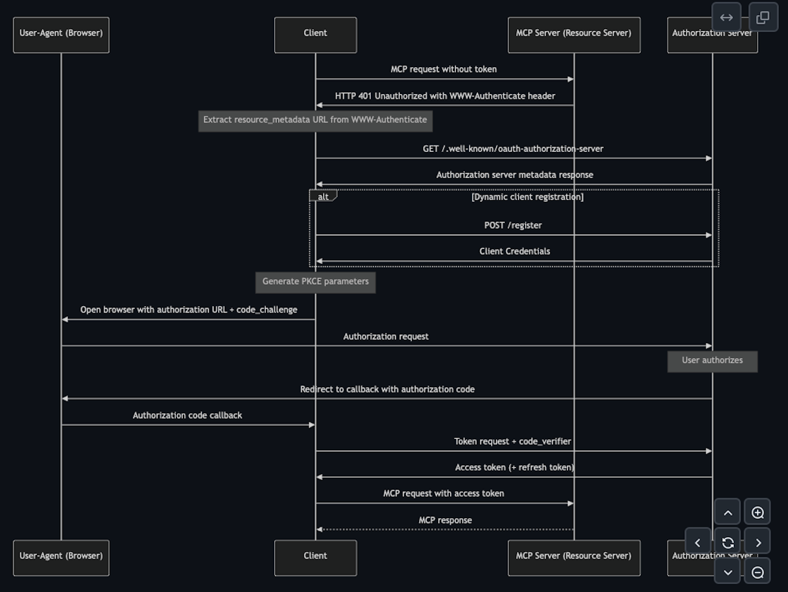

# Remote MCP (Streamable HTTP) + Authorization

This demo is created conforming the [new MCP Authorization specifciation](https://medium.com/r/?url=https%3A%2F%2Fgithub.com%2Fmodelcontextprotocol%2Fmodelcontextprotocol%2Fblob%2F44f3de53dc3b5c3752cc01f60b18615379e42a6f%2Fdocs%2Fspecification%2Fdraft%2Fbasic%2Fauthorization.mdx) where the Authorization Server and Resource server are seperated and  the flow consists of four roles

- End user
- MCP Client
- MCP Resource Server
- Authorization Sever

## Authorization Server

An OAuth2 authorization server with dynamic client registration implemented using the [node-oauth/oauth2-server](https://node-oauthoauth2-server.readthedocs.io/en/master/index.html) library.

**NOTE**: For simplification, instead of an actual database, runtime variables are used in the example to store code/token/user data.

### Protocol Endpoints
Basic implementations for the following endpoints are provided conforming to the IETF specifications.

- Authorization endpoint
    - on `GET`, shows a simple login form to collect user information that will `POST` to the same endpoint to start authorization flow.
- Token endpoint (for both authorization code exchange and refresh token exchange)
    - Access token generated will be JWT Tokens conforming to [JSON Web Token (JWT) Profile for OAuth 2.0 Access Tokens](https://www.rfc-editor.org/rfc/rfc9068.html)
- Registration endpoint for dynamic client registration
- Revocation endpoint for revoking access tokens and refresh tokens
- `/.well-known/oauth-authorization-server` for [Server Metadata](https://datatracker.ietf.org/doc/html/rfc8414) discovery

### Other Endpoints
- Error endpoint to display errors related to client's `redirect_uri`

## MCP Resource Server

A Remote MCP Resource Server using `StreamableHTTPServerTransport`.

### Features
- `/.well-known/oauth-protected-resource` end point for [Protected Resource Metadata](https://datatracker.ietf.org/doc/html/rfc9728) discovery
- requires **Authorization** in order to access the following supported features.
    - Basic functionalities, ie: Client establishing connections and sneding messages (or requests such as list tools, list resources, call tools and etc.) to the server and server responding.
    - Tools
        - A regular tool that return a single response
        - A tool that sends multiple messages back to the client with notifications

### Authorization (Token validation)
The access token required will be in the form of an JWT Token and the validation is performed by checking the signature, header, and payloads based on the specification([RFC9068](https://www.rfc-editor.org/rfc/rfc9068.html)).

Errors are handled based on [Error Response specification](https://datatracker.ietf.org/doc/html/draft-ietf-oauth-v2-1-12#name-error-response-3) using the `WWW-Authenticate` Response Header Field

## MCP Client

An MCP client connect to remote server with `StreamableHTTPClientTransport` and providing an `OAuthClientProvider` to handle authorization as needed.

By using an `OAuthClientProvider`, the SDK will

1. connect to the server with any existing access token from the provider (`OAuthClientProvider.tokens`) if there is any or try to connect without specifying any authorization parameters.
2. If the access token has expired, and we try to connect or send messages to the server, for example, by calling listTools, the provider is used to refresh the token.
3. If token refresh fails or no access token exists, and auth is required, `OAuthClientProvider` is then used to start the authorization flow and an `UnauthorizedError` will be thrown from connect or the function we used to send messages.

Internal authorization flow managed by OAuthClientProvider:

1. call `OAuthClientProvider.clientInformation` to try to load any existing client id and secret
2. If not exist and dynamic client registration is supported, try client registration and call `OAuthClientProvider.saveClientInformation` to save the registered client information
3. Call `OAuthClientProvider.redirectToAuthorization` with the authorization url
4. After we call `transport.finishAuth` with the authorization code, exchange the code for access token.

### Features
Upon start, the client will
1. Try to Connect to the server without existing authorization info
2. Upon getting an `UnauthorizedError` and `OAuthClientProvider.redirectToAuthorization` called, start a local server to receive authorization call back and open the browser with the authorization url
3. Wait for the user to log in to complete and receive authorization code (or error) within the callback
4. Call `StreamableHTTPClientTransport.finishAuth` with the authorization code to have the SDK to exchange the code for an access token to
5. Upon authorization finish, Reconnect and make some tools calls to confirm the the authorization is successful

### A Little Additional
For those who want to manage authorization using other libraries, I have also included some [sample code](./src/client/oauthOpenidClient.ts) on how to perform the enitre authorization flow using [openid-client](https://github.com/panva/openid-client/tree/main).

## Run the Example

### SDK Set up
Since the current [Typescript SDK](https://github.com/modelcontextprotocol/typescript-sdk) is not supporting the authorization flow from the newest authorization specification yet, I have [forked the repository](https://github.com/0Itsuki0/mcp-typescript-sdk-fork/) and added some changes.

PS: I have created a [PR](https://github.com/modelcontextprotocol/typescript-sdk/pull/416) for it if anyone is being super nice and wants to give it a review!

To test out the examples in this demo
1. Download the [auth-client branch of the fork](https://github.com/0Itsuki0/mcp-typescript-sdk-fork/tree/auth-client)
2. In `tsconfig`, remove `dist` from `exclude`. Ie: `"exclude": ["node_modules"]`
3. `npm run build`
2. Use the build as the dependency

### Environments
Change the following as needed in [`.env`](./.env).

#### For Client ID Encryption & Decryption
- `CIPHER_KEY`
- `CIPHER_IV`
- `CIPHER_KEY_ENCODING`
- `CIPHER_IV_ENCODING`

#### For JWT Token signing
- `ACCESS_TOKEN_SIGN_ALGORITHM`
- `ACCESS_TOKEN_SIGN_SECRET`

### Other Configurations
Change the following as needed in .

#### Auth Server
- `AUTHORIZATION_SERVER_PORT`
- `AUTHORIZATION_SERVER_HOSTNAME`
- `AUTHORIZATION_SERVER_PROTOCOL`
- `OAUTH_ROUTER_ENDPOINT`
- `AUTHORIZE_ENDPOINT`
- `TOKEN_ENDPOINT`
- `OTHER_ERROR_ENDPOINT`
- `REVOCATION_ENDPOINT`
- `REGISTRATION_ENDPOINT`
- `AUTH_METHODS`
- `GRANT_TYPES`
- `MCP_SCOPE`
- `RESPONSE_TYPES`
- `CODE_CHALLENGE_METHODS`
- `ACCESS_TOKEN_LIFETIME`
- `REFRESH_TOKEN_LIFETIME`

#### Resource Server
- `RESOURCE_SERVER_PORT`
- `RESOURCE_SERVER_PROTOCOL`
- `RESOURCE_SERVER_HOSTNAME`
- `MCP_ENDPOINT`

#### Client
- `CLIENT_SERVER_PORT`
- `CLIENT_SERVER_HOSTNAME`
- `CLIENT_SERVER_PROTOCOL`
- `CLIENT_SERVER_CALLBACK_PATH`

### Full Example
Run `npm run dev` to
- build the project
- start the authorization server
- add some dummy user data (the user that will be logged in to receive access token)
- start the MCP Resource server
- Run the MCP client

#### Console.log color
- Red: Client
- Blue: Authorization Server
- Green: Resource Server

### Authorization Server
Run `npm run dev:as` to
- build the project
- start the authorization server
- add some dummy user data (the user that will be logged in to receive access token)

### MCP Resource Server
Run `npm run dev:rs` to
- build the project
- start the MCP Resource server

### MCP Client
Run `npm run dev:client` to
- build the project
- Run the MCP client
